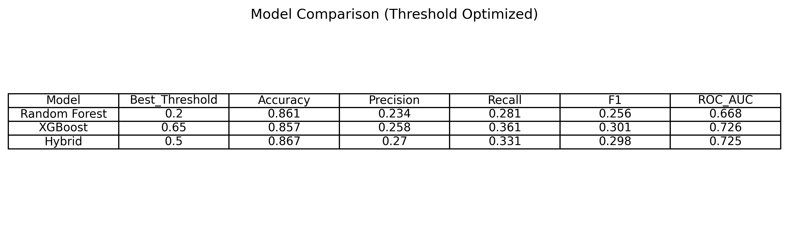
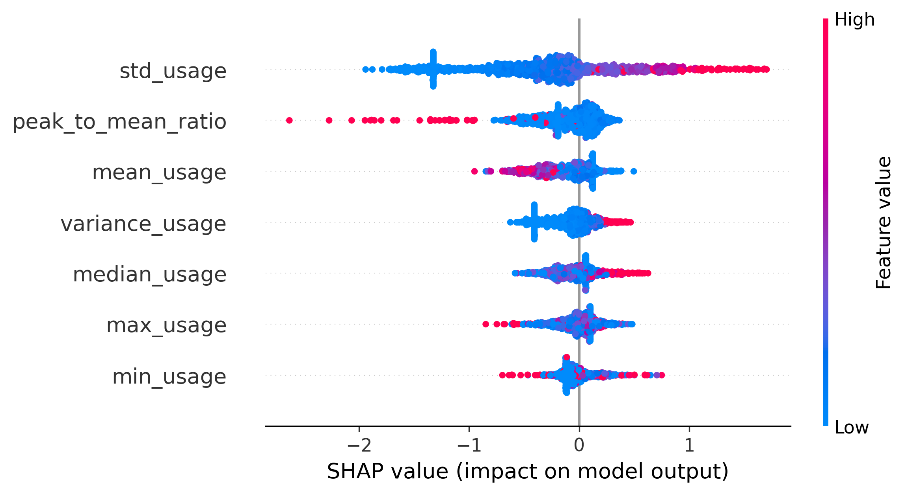
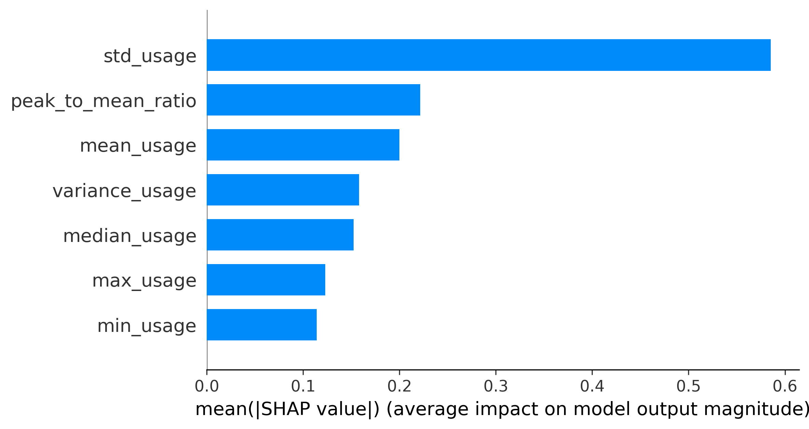

# Explainable AI-Based Electricity Theft Detection Using SHAP and Hybrid Machine Learning


---

# Overview

Electricity theft remains a significant challenge for modern smart grids, affecting distribution system reliability, operational efficiency, and utility revenue protection.

This repository presents an **Explainable Artificial Intelligence (XAI)-based electricity theft detection framework** using hybrid machine learning and SHAP (SHapley Additive exPlanations) analysis.

The proposed framework combines:

- Smart meter load behaviour features
- Power system frequency characteristics
- Hybrid machine learning models
- Model explainability techniques

to detect electricity theft patterns while providing transparent explanations of model predictions.

---

# Research Contributions

The main contributions of this work include:

- Development of a hybrid Random Forest and XGBoost electricity theft detection framework.
- Integration of smart meter consumption behaviour with frequency-based grid features.
- Implementation of SHAP-based explainability for understanding model decisions.
- Feature importance analysis identifying influential theft detection variables.
- Threshold optimisation to improve classification performance under imbalanced conditions.
- Development of a reproducible Python machine learning pipeline.

---

# Methodology

The proposed workflow consists of:

```
Smart Meter Data
|
|
Frequency Feature Integration
|
|
Feature Engineering
|
|
Hybrid ML Models
(RF + XGBoost)
|
|
Prediction Optimisation
|
|
SHAP Explainability
|
|
Feature Contribution Analysis
```

---

# Machine Learning Framework

The repository implements three machine learning models:

## Random Forest

A tree-based ensemble classifier used for robust classification and feature learning.

## XGBoost

A gradient boosting algorithm optimised for handling complex nonlinear relationships and class imbalance.

## Hybrid Ensemble Model

Random Forest and XGBoost predictions are combined using soft voting:

```
Hybrid Model = RF + XGBoost
Weights = [1,2]
```

---

# Explainable AI Framework

A key contribution of this work is the integration of SHAP explainability.

SHAP provides:

- Global feature importance
- Individual prediction explanations
- Feature contribution analysis

The repository generates:

- SHAP summary plots
- SHAP feature importance ranking
- SHAP dependence analysis

---

# Repository Structure

```
Explainable-AI-Electricity-Theft-Detection/

├── data/
│ └── README.md

├── src/
│ ├── main.py
│ ├── preprocessing.py
│ ├── train_model.py
│ ├── explainability.py
│ └── evaluate.py

├── figures/
│ ├── shap_summary_plot.png
│ ├── shap_feature_importance.png
│ ├── roc_curves.png
│ ├── confusion_matrix.png
│ └── threshold_vs_f1.png

├── results/
│ ├── model_comparison_threshold.csv
│ ├── shap_feature_importance.csv
│ └── model_comparison_threshold.png

├── requirements.txt
└── README.md
```

---

# Dataset

This project uses:

- SGCC smart meter electricity consumption data
- Frequency feature dataset derived from grid measurements

Due to dataset licensing restrictions, original datasets are not included.

Dataset preparation instructions are provided separately.

---

# Installation

Clone the repository:

```bash
git clone https://github.com/vpthesizzler/Explainable-AI-Electricity-Theft-Detection.git
```

Navigate into the repository:

```bash
cd Explainable-AI-Electricity-Theft-Detection
```

Install dependencies:

```bash
pip install -r requirements.txt
```

Run the complete pipeline:

```bash
python src/main.py
```

---

# Results

The framework is evaluated using:

- Accuracy
- Precision
- Recall
- F1-score
- ROC-AUC

## Model Performance Comparison



---

# SHAP Explainability Results

## SHAP Summary Plot



## SHAP Feature Importance



---

# Future Extensions

Future research directions include:

- Federated learning-based privacy preserving electricity theft detection.
- Real-time smart grid monitoring.
- Digital twin integration for grid resilience.
- Deployment on utility-scale smart grid platforms.

---

# Publication

**Title:**

Explainable AI-Based Electricity Theft Detection Using SHAP and Hybrid Machine Learning

**Author:**

Vrushabh Patil

**Status:**

Under Review

---

# Author

## Vrushabh Patil

MSc New and Renewable Energy
Durham University

Research Interests:

- Smart Grid Security
- Artificial Intelligence for Energy Systems
- Explainable AI
- Machine Learning Applications
- Electricity Theft Detection

---

# License

This project is licensed under the MIT License.

